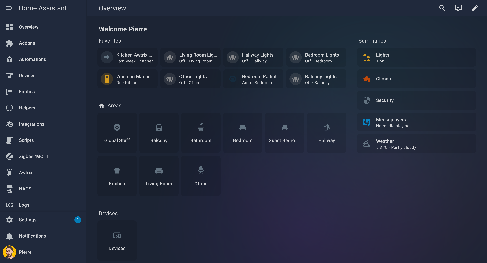
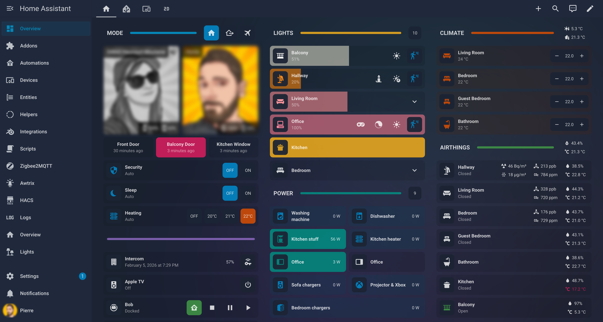
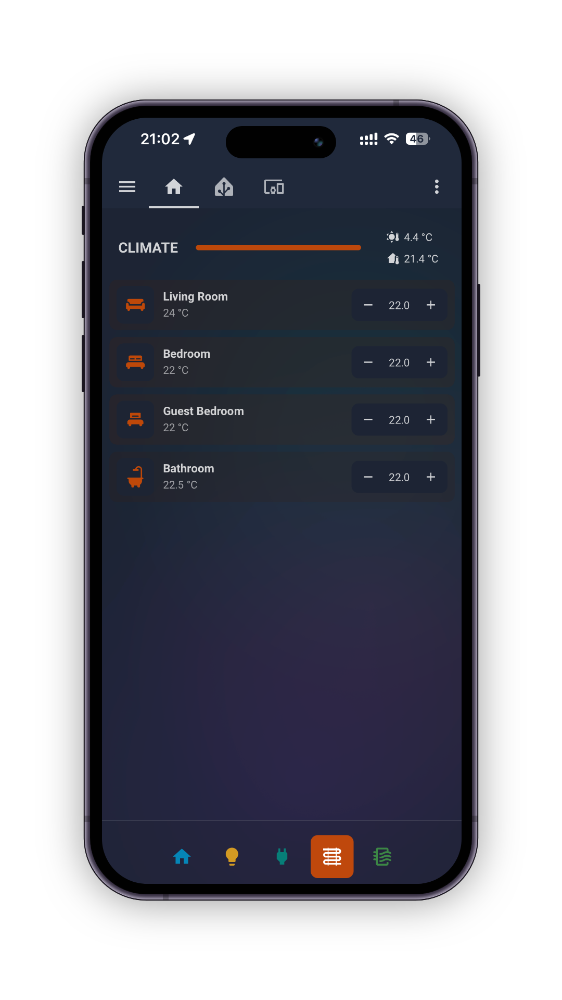

# Moselle Theme

[](https://github.com/hacs/integration)

My personal dark theme for Home Assistant, adapted to work nicely with Bubble Card.

|                           |                        |                                          |
| :---------------------------------------------------: | :-------------------------------------------------------: | :-----------------------------------------------------------------------------------------: |
| [Lovelace](https://www.home-assistant.io/dashboards/) | [With Bubble Card](https://github.com/Clooos/Bubble-Card) | [With Bubble Card Mobile Sections](https://github.com/pierrecholhot/bubble-mobile-sections) |

## Installation

### HACS

1. Open HACS
2. Go to **Frontend**
3. Click the three dots menu → **Custom repositories**
4. Add `https://github.com/pierrecholhot/moselle-theme` as a **Theme**
5. Search for **Moselle Theme** and install it
6. Restart Home Assistant

### Manual

1. Download `moselle.yaml` from the [latest release](https://github.com/pierrecholhot/moselle-theme/releases/latest)
2. Place it in `config/themes/`
3. Restart Home Assistant

### Prerequisites

Add to your `configuration.yaml`:

```yaml
frontend:
  themes: !include_dir_merge_named themes
```

## Enable Theme

1. Go to your Profile
2. Select **Moselle** from the theme dropdown

## License

MIT
